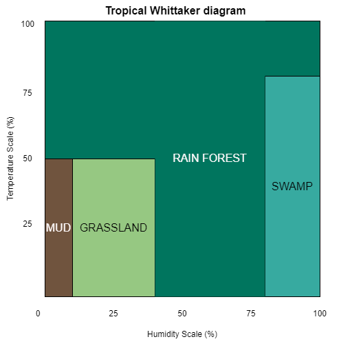
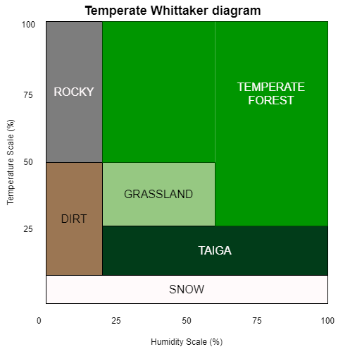
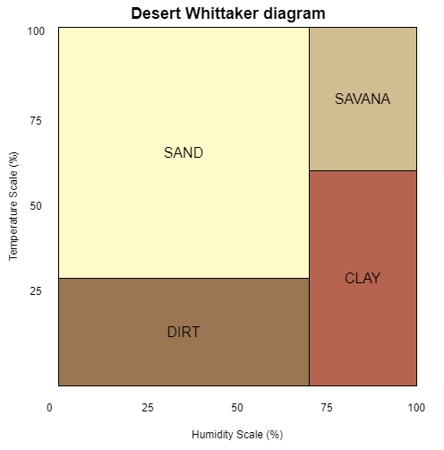
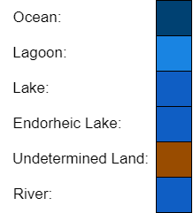
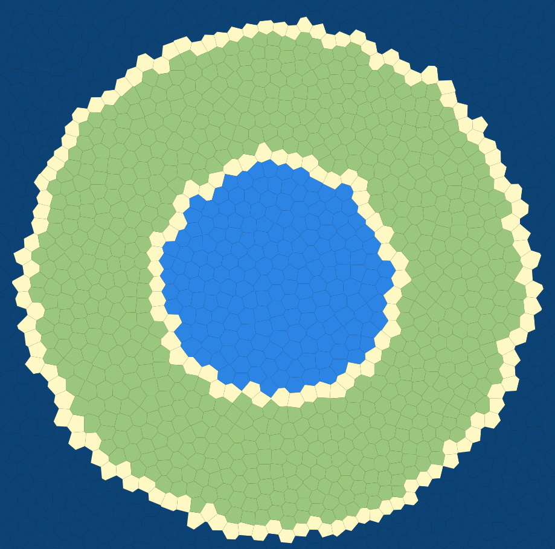

# Assignment A2: Mesh Generator
  - Mithun Paramathasan [paramatm@mcmaster.ca]
  - Nirmal Chaudhari [chaudn12@mcmaster.ca]
  - Sathurshan Arulmohan [arulmohs@mcmaster.ca]


## How to run the product

### Installation instructions

This product is handled by Maven, as a multi-module project. 

To install the different tooling on your computer, simply run:

```
mvn install
```

After installation, you'll find an application named `generator.jar` in the `generator` directory, and a file named `visualizer.jar` in the `visualizer` one. 

### Generator

To run the generator, go to the `generator` directory, and use `java -jar` to run the product. Sample.mesh is the binary file containing the mesh.

#### Grid-Based Mesh
```
cd generator 
java -jar generator.jar sample.mesh -grid [-width] [-height] [-spacing]
ls -lh sample.mesh
```
`width` and `height` default is 500px while `spacing` default is 20 and are optional to change in the command line. Note that the minimum spacing is 10. 

Example: `java -jar generator.jar sample.mesh -grid -width 400 -height 400`

#### Irregular Mesh
```
cd generator 
java -jar generator.jar sample.mesh -irregular -numPoly [-width] [-height] [-relation]
ls -lh sample.mesh
```
`numPoly` is the number of polygons to generate on the mesh.\
`width` and `height` default is 500px and are optional to change in the command line. \
`relation` default is 1 and value can be changed for any values greater than 1 to smooth the mesh.

Example: `java -jar generator.jar sample.mesh -irregular -numPoly 500 -width 600 -height 600 -relation 3`

### Island
Generates a map based on input mesh and command line arguments. 

#### Sandbox 
To run sandbox mode of the island generator, go to the `island` directory, and use `java -jar` to run the product. Use the mesh created by the generator as input mesh and enter .mesh file name to save the island generated map.  

```
cd island
java -jar island.jar -input (input.mesh) -output (output.mesh) --mode sandbox
```
The output.mesh will be stored in the directory `island` by default.

Example: `java -jar island.jar -i ../generator/sample.mesh -o sandbox.mesh --mode sandbox`

#### Whittaker Diagrams
The following graphs are the Whittaker diagrams used in this project. Note: These Whittaker diagrams are not accurate to real the world and are just created by our team for this project. 








#### Other Map Colors



### Visualizer

To visualize an existing mesh, go the the `visualizer` directory, and use `java -jar` to run the product. The product takes in the file containing the mesh, and the name of the file to store the visualization (as an SVG image).

```
cd visualizer 
java -jar visualizer.jar ../generator/sample.mesh sample.svg [-X]
ls -lh sample.svg
```
To viualize the SVG file:

  - Open it with a web browser
  - Convert it into something else with tool slike `rsvg-convert`

### Debug Visualizer
In debug mode, it will visualize the polygon's segments and vertices as black, centroid as red and neighbouring relations as grey. Debug mode uses the flag `-X`
 ```
 java -jar visualizer.jar ../generator/sample.mesh sample.svg -X
 ```

### Example runs
To see a examples of the mesh, run any one of the scripts below in the main directory. The mesh will be saved as ../generator/sample.mesh.

```./runAll```


```./runAllDebug```


```./runAllIrregular```


```./runAllDebugIrregular```


```./runSandbox```




## How to contribute to the project

When you develop features and enrich the product, remember that you have first to `package` (as in `mvn package`) it so that the `jar` file is re-generated by maven.
